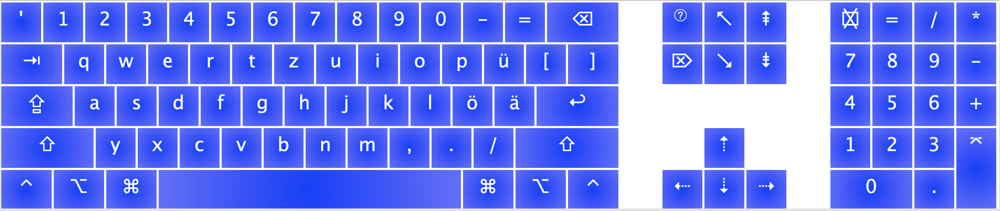
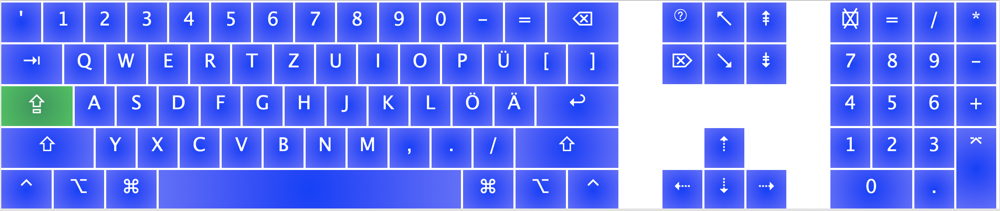
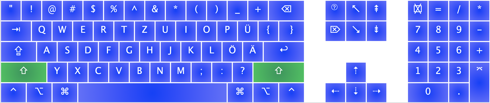
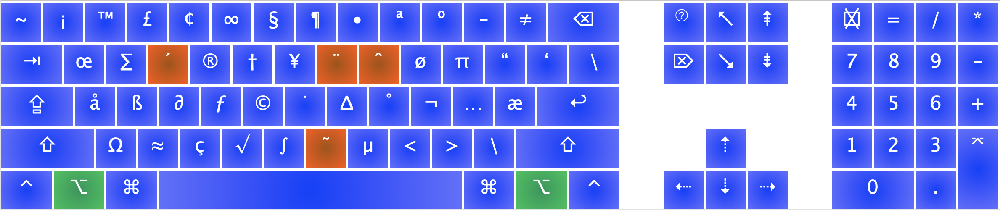

# zypro-keyboard-project

Hi! This is Zypro Keyboard Layout for macOS made with [Ukelele App](https://scripts.sil.org/cms/scripts/page.php?site_id=nrsi&id=ukelele)

This layout is designed specifically for programmers who are used to working with the top row, as well as with various characters such as brackets and punctuation marks using QWERTY keyboard, but who also needs the German QWERTZ layout letters.

That's what Zypro layout looks like:

Feel free to use this layout and be happy with your german keyboard 👍

Made by Artem Evdokimov, TUM, B.Sc. Informatics
[aevdokimoff.githib.io](http://aevdokimoff.githib.io)
